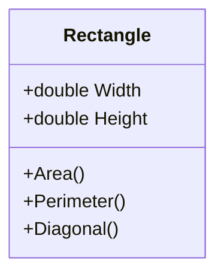

# Exercício 1 🖥️

Fazer um programa para ler os valores de largura e altura de um retângulo. Em seguida, mostrar na tela o valor de sua área, perímetro e diagonal. Usar uma classe como mostrado no projeto:

### Exemplo (**CONSOLE**)

----------------------- ------------------------------------
Enter rectangle width and height:  
3.00  
4.00  
AREA = 12.00  
PERIMETER = 14.00  
DIAGONAL = 5.00  

----------------------------------------------------------------
