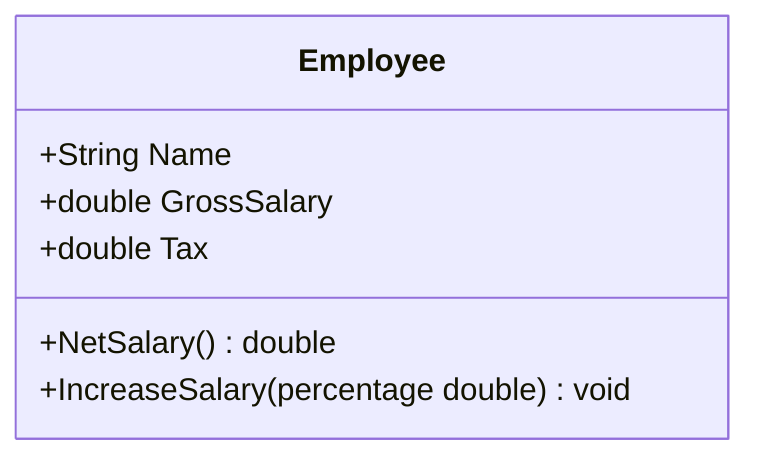

# Exercício 2 🖥️

Fazer um programa para ler os dados de um funcionário (nome, salário bruto e imposto). Em seguida, mostrar os dados do funcionário (nome e salário líquido). Em seguida, aumentar o salário do funcionário com base em uma porcentagem dada (somente o salário bruto é afetado pela porcentagem) e mostrar novamente os dados do funcionário. Use a classe projetada abaixo.

### Exemplo (**CONSOLE**):

(Entradas do usuário representadas em negrito)

--------------------
Name: **Joao Silva**  
Gross salary: **6000.00**  
Tax: **1000.00**  

Employee: Joao Silva, $ 5000.00

Which percentage to increase salary? **10.0**

Updated data: Joao Silva, $ 5600.00

--------------------
